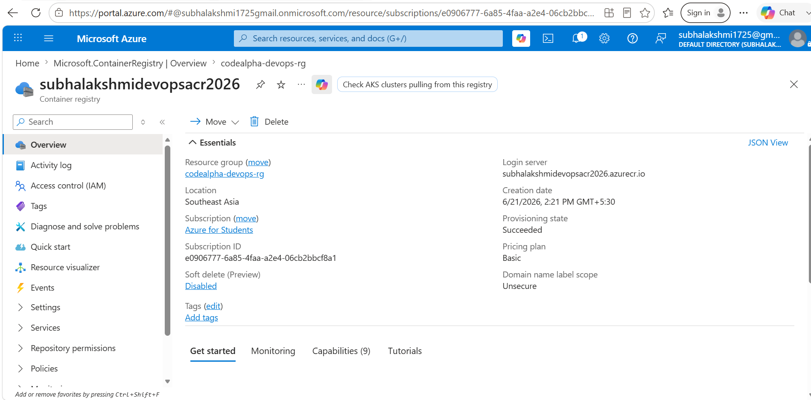

# 🚀 Enterprise CI/CD Pipeline using Azure DevOps, Docker, Azure Container Registry & Azure App Service

<p align="center">
  
  
  
  
</p>

---

# 📌 Project Overview

This project demonstrates the implementation of a cloud-native Continuous Integration and Continuous Deployment (CI/CD) workflow using Microsoft Azure services and Docker containerization.

The solution focuses on automating application packaging, validation, container image management, and deployment processes while following modern DevOps engineering practices.

Through this project, I gained practical experience in Azure cloud infrastructure provisioning, containerized application deployment, Azure resource management, and deployment automation.

---

# 🎯 Project Objectives

- Implement a modern CI/CD workflow
- Deploy containerized applications using Azure services
- Manage Docker images through Azure Container Registry
- Host applications using Azure App Service
- Practice cloud-native deployment methodologies
- Strengthen Azure and DevOps engineering skills
- Understand enterprise-inspired deployment workflows

---

# 🏗️ Solution Architecture

```text
Developer
    │
    ▼
GitHub Repository
    │
    ▼
Azure DevOps Pipeline
    │
    ├── Build Stage
    ├── Validation Stage
    └── Deployment Stage
    │
    ▼
Docker Build Process
    │
    ▼
Docker Image
    │
    ▼
Azure Container Registry
    │
    ▼
Azure App Service
    │
    ▼
Live Web Application
    │
    ▼
Monitoring & Validation
```

---

# ⚙️ Technology Stack

| Technology | Purpose |
|------------|----------|
| Azure DevOps | CI/CD Automation |
| Docker | Containerization |
| Azure Container Registry | Container Image Storage |
| Azure App Service | Application Hosting |
| Azure CLI | Resource Management |
| GitHub | Version Control |
| Nginx | Web Server |
| Linux | Runtime Environment |

---

# ☁️ Azure Infrastructure Provisioning

## Azure Resource Group

The first step of the project involved provisioning a dedicated Azure Resource Group to centrally manage all cloud resources associated with the deployment workflow.

### Key Highlights

- Centralized Azure resource management
- Organized cloud infrastructure
- Azure for Students subscription utilization
- Regional deployment configuration


---

## Azure Container Registry (ACR)

Azure Container Registry was provisioned to securely store and manage Docker container images generated throughout the deployment process.

### Key Highlights

- Private container image storage
- Secure image management
- Azure-native registry service
- Container deployment readiness

**Registry Name:** `subhalakshmidevopsacr2026`



---

## Azure App Service

A Linux-based Azure App Service was provisioned to host and serve the containerized web application.

### Key Highlights

- Linux hosting environment
- Cloud-native deployment platform
- Managed infrastructure
- Container deployment support


---

## Azure CLI Authentication

Azure CLI was installed and configured to manage cloud resources directly from the command line.

### Key Highlights

- Azure CLI configuration
- Secure authentication
- Subscription integration
- Automation readiness


---

# 🐳 Docker Implementation

Docker was used to containerize the application and create a portable deployment package.

### Features Implemented

- Lightweight Nginx base image
- Dockerized application deployment
- Container port exposure
- Health monitoring
- Deployment portability
- Consistent runtime environment

---

# 🔄 CI/CD Workflow

### Stage 1 — Source Control

Application source code is maintained using GitHub for version control and collaboration.

### Stage 2 — Build

Docker images are built from the application source code.

### Stage 3 — Validation

Automated validation checks verify build success and deployment readiness.

### Stage 4 — Container Registry

Validated Docker images are stored within Azure Container Registry.

### Stage 5 — Deployment

Azure App Service retrieves container images and deploys the application.

### Stage 6 — Monitoring

Deployment status and application health are continuously monitored.

---

# 📁 Project Structure

```text
CodeAlpha_Azure_DevOps_CICD_Container_Deployment_2026
│
├── app
│   └── index.html
│
├── Dockerfile
├── azure-pipelines.yml
├── README.md
│
└── screenshots
    ├── resource-group-overview.png
    ├── container-registry-overview.png
    ├── web-app-created.png
    └── azure-cli-login-success.png
```

---

# 📸 Deployment Evidence

## Azure Resource Group Provisioning

This screenshot shows the successful creation of the Azure Resource Group used to organize and manage all cloud resources required for the project.


---

## Azure Container Registry Deployment

This screenshot demonstrates the successful deployment of Azure Container Registry used for secure Docker image management.


---

## Azure App Service Provisioning

This screenshot shows the successful provisioning of Azure App Service that will host the containerized application.


---

## Azure CLI Authentication

This screenshot verifies successful authentication with Azure using Azure CLI and Azure for Students subscription.


---

# 🎓 Skills Demonstrated

### Cloud Engineering

- Azure Resource Management
- Azure App Service Administration
- Azure Container Registry Management

### DevOps Engineering

- Continuous Integration
- Continuous Deployment
- Deployment Automation
- Infrastructure Documentation

### Containerization

- Docker Image Creation
- Container Deployment
- Container Lifecycle Management

### Operations

- Monitoring
- Troubleshooting
- Deployment Validation
- Service Verification

---

# 📈 Key Learning Outcomes

Through this project, I gained practical experience in:

- Cloud Infrastructure Provisioning
- Azure Resource Administration
- CI/CD Pipeline Concepts
- Containerized Application Deployment
- Azure Platform Services
- Deployment Automation
- Modern DevOps Practices

---

# 🔮 Future Enhancements

- Azure DevOps Pipeline Integration
- Docker Image Publishing to ACR
- Automated Deployment Workflows
- Azure Monitor Integration
- Infrastructure as Code using Terraform
- Kubernetes Deployment using AKS
- Blue-Green Deployments

---

# 🏆 Project Impact

This project demonstrates the ability to:

✅ Provision Azure cloud infrastructure

✅ Containerize modern applications

✅ Manage container images using Azure services

✅ Deploy applications using Azure App Service

✅ Apply DevOps engineering principles

✅ Build cloud-native deployment workflows

✅ Document technical implementations professionally

---

# 📄 Conclusion

This project successfully demonstrates the implementation of a cloud-native deployment workflow using Azure cloud services and Docker containerization technologies.

By combining Azure infrastructure, Docker containers, Azure Container Registry, Azure App Service, and CI/CD principles, the project establishes a strong foundation in modern Cloud Computing and DevOps Engineering practices.

---

# 👩‍💻 Author

**Subhalakshmi Bagavathiraj**

DevOps Intern @ CodeAlpha

☁️ Cloud Computing Enthusiast  
⚙️ DevOps Learner  
🚀 Aspiring Cloud & Platform Engineer